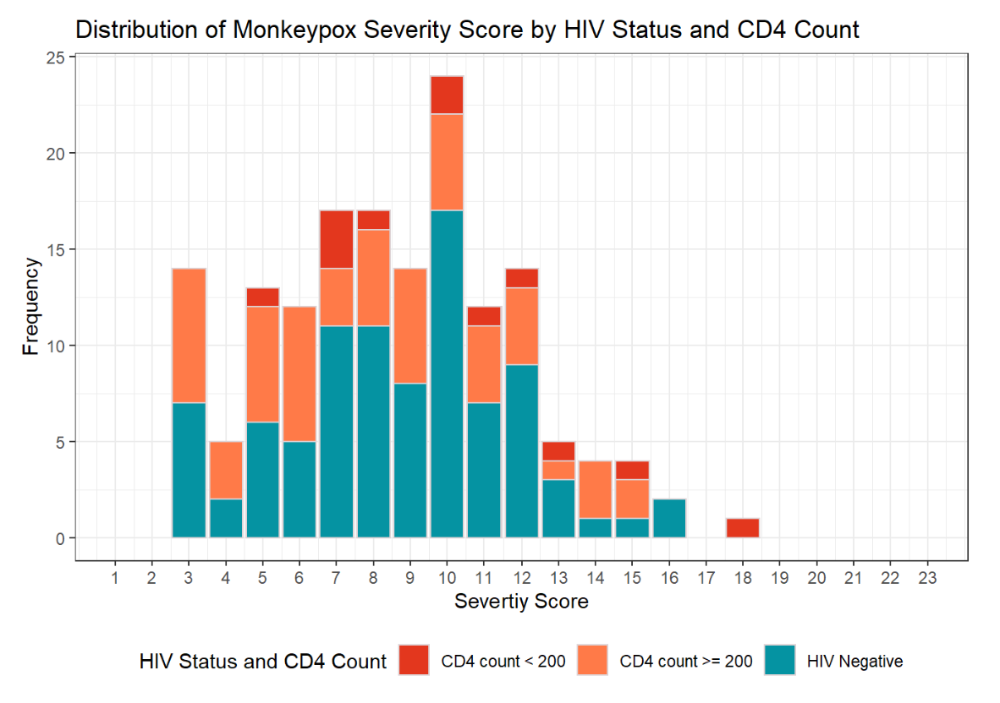
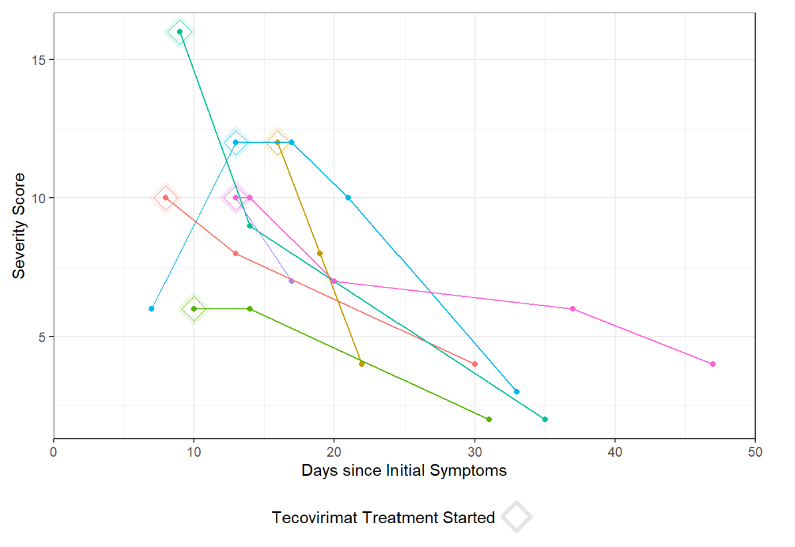

 

**METHODS**

Using expert opinion and literature review, we developed an MPOX-SSS with an initial set of possible variables that we refined based on data availability, prior association with severity, and parameter correlation to include 7 final elements: number of active lesions, anatomic extent of lesion involvement, presence of confluent lesions, presence of bacterial superinfection, extent of mucosal areas affected, level of care, and analgesia requirement (tool available at mpoxseverityscore.com). We piloted this MPOX-SSS via a retrospective chart review at a single academic urban medical center and compared scores using the Wilcoxon rank sum test.

 

**RESULTS**

Among the first 200 patients presenting with mpox (median age 34, 99% born male, 38% Hispanic, 28% Black, 49% with HIV [10% CD4 count <200 cells/mm3 or VL>1000 copies/mL], 57% treated with tecovirimat), an MPOX-SSS score could be calculated for 86%; missing data that precluded scoring included lesion number (13%) and presence of confluent lesions (7%). Median scores were similar in patients with and without HIV (8 vs 9, p=0.12)(Figure 1A). Scores were higher in patients treated with tecovirimat (10 vs 4, p<0.001), patients with CD4 counts <200 cells/mm3 (10 vs 8, p=0.073), and patients presenting >3 days after symptom onset (9 vs 6, p=0.007). For a subset of individuals with multiple visits for mpox, changes in MPOX-SSS scores were detected and concordant with clinical experience (Figure 1B).

 

**FIGURES**

**Figure 1A: Monkeypox Severity Score Distribution by HIV Status**

**Figure 1B: Monkeypox Severity Score Overtime**

